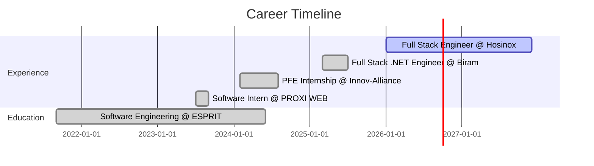

# Hi, I'm Arij Hajjaji 👋

<div align="center">
  


</div>

<p align="center">
  
</p>

<div align="center">

### 📬 Let's Connect!

[](https://linkedin.com/in/arij-hajjaji)
[](https://portfolio-arijhajjajivercelapp.vercel.app/)
[](mailto:arijhajjaji2@gmail.com)


**📍 Location:** Tunis, Tunisia 

</div>

---

## 🚀 About Me

```javascript
const arij = {
    location: "Tunis, Tunisia 🇹🇳",
    currentRole: "Full Stack Engineer @ Hosinox Company",
    expertise: ["Microservices Architecture", "DevOps", "AI Integration"],
    currentlyWorking: "Enterprise ERP Systems with Spring Boot & Angular",
    currentlyLearning: ["Spring AI", "Advanced Kubernetes", "System Design"],
    funFact: "I automate everything... even my coffee breaks ☕",
    lifePhilosophy: "Clean code is not written by following a set of rules. " +
                     "You don't become a software craftsman by learning a list of heuristics."
};
```


### 💡 What I Do

- 🏗️ Build **scalable microservices** architectures
- ⚡ Develop **full-stack applications** with modern frameworks
- 🤖 Integrate **AI-powered features** into business applications
- 🐳 Design **containerized deployments** with Docker & Kubernetes
- 📊 Implement **CI/CD pipelines** for automated workflows
- 🔒 Ensure **security best practices** in every project

<br clear="right"/>

---

## 🛠️ Tech Arsenal

<details open>
<summary><b>💻 Languages</b></summary>
<br>


</details>

<details open>
<summary><b>🎨 Frontend & Backend</b></summary>
<br>

**Backend:**  


**Frontend:**  


</details>

<details open>
<summary><b>🗄️ Databases & Caching</b></summary>
<br>


</details>

<details open>
<summary><b>🐳 DevOps & Cloud</b></summary>
<br>


</details>

<details open>
<summary><b>🔧 Tools & Platforms</b></summary>
<br>


</details>

---

## 🎯 Featured Projects

<div align="center">

### 🤖 Aura: Intelligent AI Assistant
(https://github.com/Arijhajjaji22/AI-Assistant-Pro)

**Full-stack AI assistant with microservices architecture**
- 🔐 RSA JWT Authentication & Spring Security
- 📄 PDF RAG (Retrieval-Augmented Generation)
- 🖼️ Image Analysis with Google Gemini API
- 🌐 Real-time Web Scraping
- ⚡ Redis Caching & Nginx Reverse Proxy
- 🚀 Automated CI/CD via GitHub Actions

**Tech:** `Spring Boot 3` `Spring AI` `Angular` `PostgreSQL` `PGVector` `Redis` `Docker` `Nginx`

---

### 📋 TaskFlow: Real-Time Collaborative Kanban
(https://github.com/Arijhajjaji22/Taskflow-n8n)

**Event-driven Kanban board with real-time collaboration**
- 🔒 OAuth2/Keycloak Authentication
- 🔄 GraphQL API for flexible queries
- 📡 WebSocket/STOMP Real-time Notifications
- 🤖 n8n Workflow Automation
- 📨 Apache Kafka Event Streaming
- 🎨 Drag-and-Drop Interface

**Tech:** `Spring Boot 3` `GraphQL` `Kafka` `Keycloak` `Angular` `PostgreSQL` `Flyway`

---

### 💻 AI Code Assistant Pro — VS Code Extension
(https://github.com/Arijhajjaji22/aura-chatbot)


**VS Code plugin for intelligent code analysis & refactoring**
- 🐛 Real-time Bug Detection
- 🔒 Security Vulnerability Scanning (OWASP Top 10)
- 🌳 AST Parsing with Tree-sitter
- 🤖 AI-Powered Code Suggestions
- ♻️ Automated Refactoring
- 🔗 Git Integration

**Tech:** `Node.js` `VS Code API` `Google Gemini` `Tree-sitter` `Snyk API` `NodeGit`

---

### 🏢 Enterprise Recruitment Platform
(https://github.com/Arijhajjaji22/RecruitmentPlatform-PFE)

**Full-featured recruitment platform with automated testing**
- ✅ Online Assessments & Instant Results
- 📊 Automated Application Processing
- 📈 CI/CD Pipeline with Monitoring
- 🔐 JWT Authentication & Authorization
- 📧 Real-time Notifications with SignalR

**Tech:** `.NET 8` `C#` `Razor` `MySQL` `XUnit` `Jenkins` `Docker` `Prometheus` `Grafana`

[🎥 Watch Demo Video](https://drive.google.com/file/d/1x6rwel4OfuMKxHB58Nx5pQYSKrzvLA1E/view?usp=sharing)

</div>

---

## 🏆 Achievements & Certifications

<p align="center">
  
</p>

<div align="center">

| Certificate | Issuer | Link |
|-------------|--------|------|
| 🌱 **Spring / Angular Development** | CrocoCoder | [View Certificate](https://drive.google.com/file/d/1Z4R1AFbQzGYGuSAlRgqaMeTVLmdxE-fk/view?usp=sharing) |
| 🤖 **AI Predictive Maintenance** | ESPRIT | [View Certificate](https://drive.google.com/file/d/1YDb5Vo-LWGmVt-jaIbNRnEnxF_ecwzcc/view?usp=sharing) |
| 🔍 **AI Anomaly Detection** | ESPRIT | [View Certificate](https://drive.google.com/file/d/19ROoMFbfwOJuM-21tdXH2cLAxo83Oqea/view?usp=drive_link) |

</div>

---

## 💼 Professional Journey



<table>
<tr>
<td width="50%">

### 🔹 Current Role
**Full Stack Engineer**  
*Hosinox Company | Jan 2026 - Present*

- Enterprise ERP development
- Spring Boot & Angular stack
- Microservices architecture
- Real-time features with WebSockets

</td>
<td width="50%">

### 🎓 Education
**Software Engineering Degree**  
*ESPRIT | 2021 - 2024*

- Focus on Full-Stack Development
- DevOps & CI/CD practices
- AI & Machine Learning applications

</td>
</tr>
</table>

---
## 🎯 Current Focus

<table>
<tr>
<td>

### 🔨 Working On
- 🏗️ Enterprise ERP System
- 🤖 AI-Powered Features
- 📊 Real-time Analytics Dashboard

</td>
<td>

### 📚 Learning
- ☸️ Advanced Kubernetes
- 🧠 Spring AI Framework
- 🎨 System Design Patterns

</td>
</tr>
</table>

---

## 💡 Developer Insights

<details>
<summary><b>🧠 My Development Philosophy</b></summary>
<br>

```typescript
class DeveloperMindset {
    principles = {
        code: "Clean, Scalable, Maintainable",
        testing: "Test-Driven Development",
        deployment: "Continuous Integration & Delivery",
        learning: "Never Stop Growing",
        collaboration: "Communication is Key"
    };
    
    approach() {
        return `
            1. Understand the problem deeply
            2. Design before coding
            3. Write tests first
            4. Refactor continuously
            5. Document thoroughly
            6. Deploy with confidence
        `;
    }
}
```

</details>

<details>
<summary><b>🛠️ Development Setup</b></summary>
<br>

**💻 Hardware:**
- Processor: Intel Core i5
- RAM: 32GB DDR4
- SSD: 1TB NVMe

**⚙️ Software:**
- OS: Windows 11 / Ubuntu 22.04 (Dual Boot)
- IDE: IntelliJ IDEA Ultimate, VS Code
- Terminal: Windows Terminal with Oh My Posh
- Browser: Chrome with Dev Tools

**🎨 VS Code Extensions:**
- Spring Boot Extension Pack
- Angular Language Service
- Docker Extension
- GitLens
- REST Client


</details>

---

## 🤝 Let's Connect!

<p align="center">
  <a href="https://linkedin.com/in/arij-hajjaji">
    
  </a>
  <a href="mailto:arijhajjaji2@gmail.com">
    
  </a>
  <a href="https://portfolio-arijhajjaji">
    
  </a>
</p>

<p align="center">
  
</p>

<div align="center">

### 💭 *"Code is like humor. When you have to explain it, it's bad."* – Cory House

### Show some ❤️ by starring some of my repositories!

</div>
